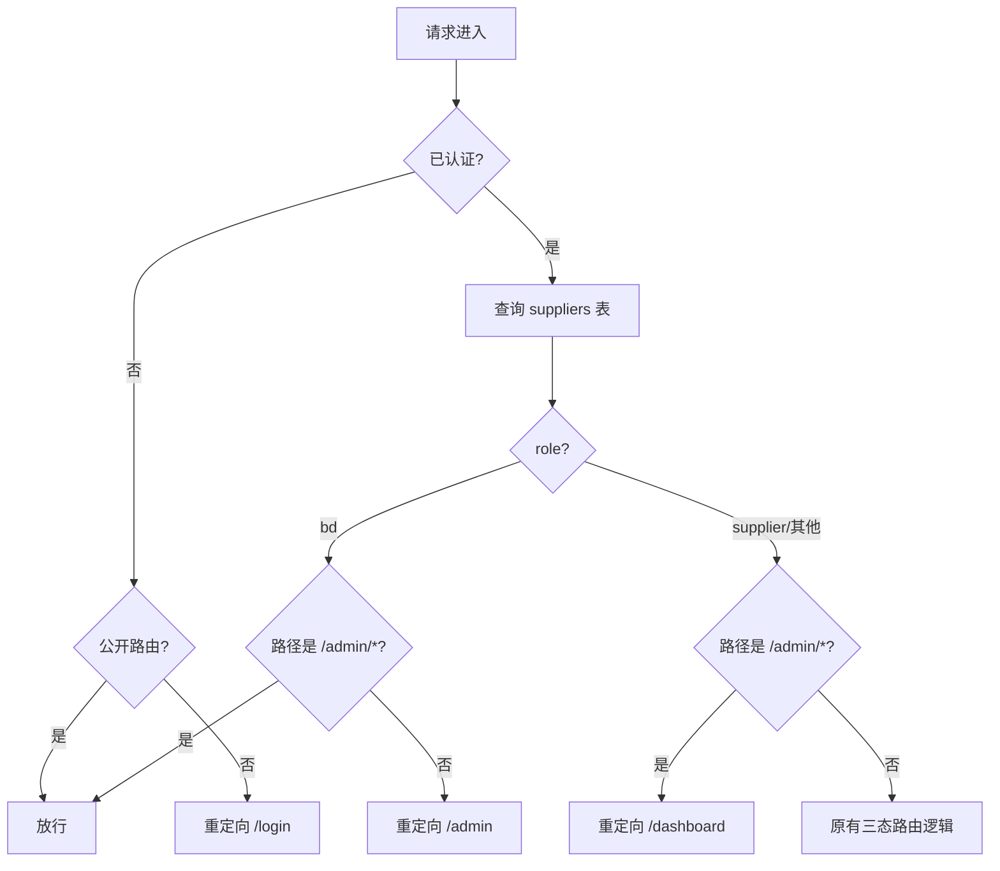

# 设计文档：BD Admin Dashboard

## 概述

BD Admin Dashboard 为异乡好居商务拓展人员提供可视化管理界面，替代当前基于 curl 命令的操作方式。系统基于现有 Next.js App Router + Supabase 技术栈构建，复用 OTP 登录机制，通过 `suppliers.role` 字段区分 BD 与供应商角色。

核心设计决策：
- 路由层面：扩展现有中间件，增加 BD 角色识别和 `/admin` 路由守卫
- API 层面：BD 管理 API 使用 Session-based 鉴权（验证 `role='bd'`），替代原有的 `x-admin-secret` Header 方式
- UI 层面：`/admin` 下独立布局，侧边栏导航，Mobile-First 响应式

## 架构

### 整体架构

```mermaid
graph TB
    subgraph "客户端"
        A[BD 浏览器] -->|OTP 登录| B[/login]
        A -->|管理操作| C[/admin/*]
    end

    subgraph "Next.js App Router"
        B --> D[Middleware]
        C --> D
        D -->|role=bd| E[Admin Layout]
        D -->|role=supplier| F[Supplier Dashboard]
        E --> G[Admin Pages]
        G --> H[Server Components]
        H --> I[API Routes /api/admin/*]
    end

    subgraph "Supabase"
        I -->|Service Role Key| J[(PostgreSQL)]
        D -->|Anon Key| J
        I -->|Admin API| K[Auth Service]
    end
```

### 路由结构

```
/admin                    → 管理后台首页（重定向到申请列表）
/admin/applications       → 申请列表页
/admin/suppliers          → 供应商列表页
/admin/suppliers/[id]     → 供应商详情页
/admin/invite             → 手动邀请供应商页
/api/admin/approve-supplier  → 审批 API（重构为 Session 鉴权）
/api/admin/invite-supplier   → 手动邀请 API（新增）
```

### 中间件路由决策流程



## 组件与接口

### 1. 中间件扩展（`src/lib/supabase/middleware.ts`）

现有中间件仅查询 `status`，需扩展为同时查询 `role` 和 `status`：

```typescript
// 修改前
const { data: supplier } = await supabase
  .from("suppliers")
  .select("status")
  .eq("user_id", user.id)
  .single();

// 修改后
const { data: supplier } = await supabase
  .from("suppliers")
  .select("status, role")
  .eq("user_id", user.id)
  .single();

const role = supplier?.role || "supplier";
const status = supplier?.status || "NEW";

// BD 角色路由
if (role === "bd") {
  if (!pathname.startsWith("/admin") && !pathname.startsWith("/auth") && !pathname.startsWith("/api/")) {
    return NextResponse.redirect(new URL("/admin", request.url));
  }
  return supabaseResponse; // 放行 /admin/* 请求
}

// 非 BD 用户禁止访问 /admin
if (pathname.startsWith("/admin")) {
  return NextResponse.redirect(new URL("/dashboard", request.url));
}

// 原有三态路由逻辑保持不变...
```

### 2. Admin Layout（`src/app/admin/layout.tsx`）

Server Component，负责：
- 验证用户身份和 BD 角色（双重保障，中间件 + 页面级）
- 渲染侧边栏导航和顶部栏
- 提供响应式布局容器

```typescript
interface AdminLayoutProps {
  children: React.ReactNode;
}

// Server Component
async function AdminLayout({ children }: AdminLayoutProps) {
  // 1. 获取当前用户
  // 2. 查询 supplier 记录验证 role='bd'
  // 3. 渲染布局：侧边栏 + 内容区
}
```

### 3. 侧边栏组件（`src/components/admin/Sidebar.tsx`）

Client Component，负责：
- 渲染导航菜单项
- 响应式折叠（移动端汉堡菜单）
- 高亮当前活跃路由

```typescript
interface SidebarProps {
  currentPath: string;
}

interface NavItem {
  label: string;
  href: string;
  icon: React.ComponentType;
}

const NAV_ITEMS: NavItem[] = [
  { label: "申请列表", href: "/admin/applications", icon: InboxIcon },
  { label: "供应商列表", href: "/admin/suppliers", icon: UsersIcon },
  { label: "邀请供应商", href: "/admin/invite", icon: UserPlusIcon },
];
```

### 4. API 路由

#### 4.1 审批 API 重构（`/api/admin/approve-supplier`）

重构现有 API，从 `x-admin-secret` Header 鉴权改为 Session-based 鉴权：

```typescript
async function POST(request: Request) {
  // 1. 从 cookie 获取 session，验证 role='bd'
  // 2. 接收 application_id 和 contract_type
  // 3. 使用 Supabase Admin Client 执行：
  //    a. 查询 application 记录
  //    b. inviteUserByEmail 创建 Auth 用户
  //    c. 插入 suppliers 记录 (status=PENDING_CONTRACT)
  //    d. 插入 contracts 记录
  //    e. 更新 application 状态为 CONVERTED
  // 4. 返回结果
}
```

#### 4.2 手动邀请 API（`/api/admin/invite-supplier`）

新增 API，BD 直接邀请供应商（不依赖 application）：

```typescript
async function POST(request: Request) {
  // 1. Session 鉴权，验证 role='bd'
  // 2. 接收 email, company_name, phone?, city?, website?
  // 3. 验证 email 不在 suppliers 表中
  // 4. 使用 Supabase Admin Client 执行：
  //    a. inviteUserByEmail 创建 Auth 用户
  //    b. 插入 suppliers 记录 (status=PENDING_CONTRACT)
  //    c. 插入 contracts 记录
  // 5. 返回结果
}
```

#### 4.3 BD 鉴权辅助函数（`src/lib/admin/auth.ts`）

抽取公共鉴权逻辑，供所有 admin API 路由复用：

```typescript
interface BdAuthResult {
  user: User;
  supplier: Supplier;
}

async function verifyBdRole(): Promise<BdAuthResult | Response> {
  // 1. 创建 server Supabase client
  // 2. getUser() 获取当前用户
  // 3. 查询 suppliers 表验证 role='bd'
  // 4. 返回用户信息或 403 Response
}
```

### 5. 页面组件

#### 5.1 申请列表页（`src/app/admin/applications/page.tsx`）

Server Component，展示 `applications` 表数据：

```typescript
interface ApplicationRow {
  id: string;
  company_name: string;
  contact_email: string;
  contact_phone: string | null;
  city: string | null;
  country: string | null;
  website: string | null;
  status: "PENDING" | "CONVERTED" | "REJECTED";
  created_at: string;
}
```

#### 5.2 供应商列表页（`src/app/admin/suppliers/page.tsx`）

Server Component，展示 `suppliers` 表中 `role='supplier'` 的记录，并聚合楼宇数量：

```typescript
interface SupplierRow {
  id: string;
  company_name: string;
  contact_email: string;
  status: "NEW" | "PENDING_CONTRACT" | "SIGNED";
  building_count: number;
  created_at: string;
}
```

#### 5.3 供应商详情页（`src/app/admin/suppliers/[id]/page.tsx`）

Server Component，展示单个供应商的完整信息：

```typescript
interface SupplierDetail {
  id: string;
  company_name: string;
  contact_email: string;
  role: string;
  status: string;
  created_at: string;
  buildings: BuildingInfo[];
  contracts: ContractInfo[];
}

interface BuildingInfo {
  id: string;
  building_name: string;
  building_address: string;
  onboarding_status: string;
  score: number | null;
}

interface ContractInfo {
  id: string;
  status: string;
  embedded_signing_url: string | null;
  created_at: string;
}
```

#### 5.4 审批确认对话框（`src/components/admin/ApproveDialog.tsx`）

Client Component，审批操作的确认弹窗：

```typescript
interface ApproveDialogProps {
  application: ApplicationRow;
  onConfirm: (contractType: string) => Promise<void>;
  onCancel: () => void;
}
```

#### 5.5 邀请表单（`src/components/admin/InviteForm.tsx`）

Client Component，手动邀请供应商的表单：

```typescript
interface InviteFormData {
  email: string;        // 必填
  company_name: string; // 必填
  phone?: string;       // 选填
  city?: string;        // 选填
  website?: string;     // 选填
}
```

## 数据模型

### 现有表结构（无需修改）

系统复用现有数据库表，无需新增表或字段：

#### applications 表
| 字段 | 类型 | 说明 |
|------|------|------|
| id | uuid | 主键 |
| company_name | text | 公司名称 |
| contact_email | text | 联系邮箱 |
| contact_phone | text | 联系电话 |
| city | text | 城市 |
| country | text | 国家 |
| website | text | 网站 |
| status | text | 状态：PENDING / CONVERTED / REJECTED |
| created_at | timestamptz | 创建时间 |

#### suppliers 表
| 字段 | 类型 | 说明 |
|------|------|------|
| id | uuid | 主键 |
| user_id | uuid | FK → auth.users |
| company_name | text | 公司名称 |
| contact_email | text | 联系邮箱 |
| status | text | NEW / PENDING_CONTRACT / SIGNED |
| role | text | supplier / bd / data_team |
| created_at | timestamptz | 创建时间 |

#### contracts 表
| 字段 | 类型 | 说明 |
|------|------|------|
| id | uuid | 主键 |
| supplier_id | uuid | FK → suppliers |
| status | text | 合同状态 |
| signature_request_id | text | OpenSign 签署请求 ID |
| embedded_signing_url | text | 嵌入式签署链接 |
| signature_provider | text | 签署服务商 |
| provider_metadata | jsonb | 签署元数据 |
| created_at | timestamptz | 创建时间 |

#### buildings 表
| 字段 | 类型 | 说明 |
|------|------|------|
| id | uuid | 主键 |
| supplier_id | uuid | FK → suppliers |
| building_name | text | 楼宇名称 |
| building_address | text | 楼宇地址 |
| onboarding_status | text | 入驻状态 |
| score | numeric | 入驻评分 |
| created_at | timestamptz | 创建时间 |

### 数据查询模式

#### 供应商列表查询（含楼宇计数）

BD 查看供应商列表时需要聚合楼宇数量。由于 Supabase JS Client 不直接支持 `COUNT` 聚合，采用两步查询：

```typescript
// 步骤 1：查询所有 supplier 角色的供应商
const { data: suppliers } = await supabaseAdmin
  .from("suppliers")
  .select("id, company_name, contact_email, status, created_at")
  .eq("role", "supplier")
  .order("created_at", { ascending: false });

// 步骤 2：查询每个供应商的楼宇数量
const supplierIds = suppliers.map(s => s.id);
const { data: buildings } = await supabaseAdmin
  .from("buildings")
  .select("supplier_id")
  .in("supplier_id", supplierIds);

// 步骤 3：在内存中聚合
const countMap = new Map<string, number>();
buildings?.forEach(b => {
  countMap.set(b.supplier_id, (countMap.get(b.supplier_id) || 0) + 1);
});
```

#### 供应商详情查询

```typescript
// 供应商基本信息
const { data: supplier } = await supabaseAdmin
  .from("suppliers")
  .select("*")
  .eq("id", supplierId)
  .single();

// 关联楼宇
const { data: buildings } = await supabaseAdmin
  .from("buildings")
  .select("id, building_name, building_address, onboarding_status, score")
  .eq("supplier_id", supplierId);

// 关联合同
const { data: contracts } = await supabaseAdmin
  .from("contracts")
  .select("id, status, embedded_signing_url, created_at")
  .eq("supplier_id", supplierId);
```


## 正确性属性

*属性（Property）是系统在所有有效执行中都应保持为真的特征或行为——本质上是对系统应做什么的形式化陈述。属性是人类可读规格与机器可验证正确性保证之间的桥梁。*

### Property 1: BD 用户路由到 /admin

*对于任意* role='bd' 的已认证用户和任意非 /admin、非 /auth、非 /api 的路径，中间件应将该用户重定向到 `/admin`。

**Validates: Requirements 1.1**

### Property 2: 非 BD 用户无法访问 /admin

*对于任意* role 不为 'bd' 的用户（包括 supplier、data_team 或未认证用户），访问任意 `/admin/*` 路径时，中间件应将其重定向到 `/dashboard`（已认证）或 `/login`（未认证）。

**Validates: Requirements 1.3, 1.4**

### Property 3: 申请列表筛选正确性

*对于任意* 申请数据集和任意状态筛选条件（PENDING / CONVERTED / REJECTED），筛选后返回的所有申请记录的 `status` 字段应与筛选条件完全匹配，且不遗漏任何匹配记录。

**Validates: Requirements 3.1, 3.3**

### Property 4: 申请列表排序正确性

*对于任意* 申请列表查询结果，相邻两条记录的 `created_at` 应满足前一条的时间戳大于等于后一条（倒序）。

**Validates: Requirements 3.4**

### Property 5: 记录渲染完整性

*对于任意* 申请记录，渲染结果应包含公司名称、联系邮箱、联系电话、城市、国家、网站、状态、提交时间全部字段。*对于任意* 供应商记录，渲染结果应包含公司名称、联系邮箱、入驻状态、关联楼宇数量、创建时间全部字段。

**Validates: Requirements 3.2, 5.2**

### Property 6: 供应商创建流程一致性

*对于任意* 有效的供应商创建请求（无论来自审批申请还是手动邀请），执行成功后 `suppliers` 表应新增一条 `status='PENDING_CONTRACT'` 的记录，`contracts` 表应新增一条关联该供应商的合同记录。

**Validates: Requirements 4.2, 8.3**

### Property 7: 审批失败保持原始状态

*对于任意* 审批操作，如果执行过程中任一步骤失败，`applications` 表中该申请的 `status` 应保持为 `PENDING` 不变。

**Validates: Requirements 4.4**

### Property 8: 非 PENDING 申请不可审批

*对于任意* `status` 不为 `PENDING` 的申请记录，调用审批 API 应返回错误响应，且 `suppliers` 表和 `contracts` 表不产生新记录。

**Validates: Requirements 4.5**

### Property 9: 供应商列表仅含 supplier 角色

*对于任意* 供应商列表查询结果，所有返回记录的 `role` 字段应为 `supplier`，不包含 `bd` 或 `data_team` 角色的记录。

**Validates: Requirements 5.1**

### Property 10: 供应商状态筛选正确性

*对于任意* 供应商数据集和任意状态筛选条件（NEW / PENDING_CONTRACT / SIGNED），筛选后返回的所有供应商记录的 `status` 字段应与筛选条件完全匹配。

**Validates: Requirements 5.3**

### Property 11: 供应商详情数据完整性

*对于任意* 供应商 ID，详情查询返回的楼宇列表应与 `buildings` 表中 `supplier_id` 匹配的记录集合一致，合同列表应与 `contracts` 表中 `supplier_id` 匹配的记录集合一致。

**Validates: Requirements 6.1, 6.2, 6.3**

### Property 12: BD API 鉴权

*对于任意* 用户和任意 `/api/admin/*` 端点，API 返回成功响应当且仅当该用户的 `role` 为 `bd`。非 BD 用户应收到 403 Forbidden 响应。

**Validates: Requirements 7.2, 7.3**

### Property 13: 邀请表单验证

*对于任意* 邀请表单输入，当 `email` 为空或格式不合法，或 `company_name` 为空时，表单验证应拒绝提交。当所有必填字段有效时，表单验证应通过。

**Validates: Requirements 8.2**

### Property 14: 重复邮箱邀请拒绝

*对于任意* 已存在于 `suppliers` 表中的邮箱地址，调用邀请 API 应返回错误响应，且不创建新的 `suppliers` 或 `contracts` 记录。

**Validates: Requirements 8.4**

## 错误处理

### API 层错误处理

| 错误场景 | HTTP 状态码 | 响应体 | 处理方式 |
|----------|------------|--------|---------|
| 未认证用户调用 admin API | 401 | `{ error: "Unauthorized" }` | 前端重定向到登录页 |
| 非 BD 角色调用 admin API | 403 | `{ error: "Forbidden. BD role required." }` | 前端显示权限不足提示 |
| 申请不存在 | 404 | `{ error: "Application not found" }` | 前端显示记录不存在 |
| 申请状态非 PENDING | 400 | `{ error: "Cannot approve application with status: X" }` | 前端显示状态冲突 |
| 邮箱已注册为供应商 | 409 | `{ error: "Email already registered as supplier" }` | 前端显示重复邮箱提示 |
| Supabase Auth 创建用户失败 | 500 | `{ error: "Failed to create auth user", details: "..." }` | 前端显示系统错误 |
| 数据库写入失败 | 500 | `{ error: "Database operation failed", details: "..." }` | 前端显示系统错误 |

### 前端错误处理

- 所有 API 调用使用 try-catch 包裹
- 网络错误显示通用错误提示："操作失败，请稍后重试"
- API 返回的 `error` 字段直接展示给用户
- 加载状态使用 loading spinner 防止重复提交
- 审批/邀请操作使用乐观锁（按钮 disabled 状态）防止并发

### 事务一致性

审批流程涉及多表写入（auth.users → suppliers → contracts → applications），当前 Supabase JS Client 不支持事务。采用以下策略：

1. 按依赖顺序执行写入
2. 如果中间步骤失败，返回错误但不回滚已完成的步骤
3. 在 API 响应中包含已完成的步骤信息，便于人工排查
4. 未来可通过 Supabase Database Functions（PL/pgSQL）实现真正的事务

## 测试策略

### 测试框架选型

- 单元测试 & 属性测试：Vitest + fast-check
- 组件测试：Vitest + React Testing Library
- E2E 测试：Playwright（项目已有配置）

### 属性测试（Property-Based Testing）

每个正确性属性对应一个属性测试，使用 `fast-check` 库生成随机输入，最少运行 100 次迭代。

测试标注格式：`Feature: bd-admin-dashboard, Property N: {property_text}`

关键属性测试：

1. **中间件路由属性测试**（Property 1, 2）：生成随机用户角色和路径组合，验证中间件路由决策正确性
2. **筛选与排序属性测试**（Property 3, 4, 9, 10）：生成随机数据集和筛选条件，验证查询结果正确性
3. **供应商创建流程测试**（Property 6）：生成随机有效输入，验证多表写入一致性
4. **鉴权属性测试**（Property 12）：生成随机用户角色，验证 API 访问控制
5. **表单验证属性测试**（Property 13）：生成随机表单输入（有效和无效），验证验证逻辑

### 单元测试

单元测试聚焦于：
- 特定边界情况（空数据、null 值）
- 错误条件（网络失败、数据库错误）
- 组件渲染（关键 UI 元素存在性）

### 测试文件组织

```
src/
├── lib/admin/__tests__/
│   ├── auth.test.ts           # BD 鉴权辅助函数测试
│   ├── middleware-routing.test.ts  # 中间件路由属性测试
│   └── invite-validation.test.ts  # 邀请表单验证测试
├── app/api/admin/__tests__/
│   ├── approve-supplier.test.ts   # 审批 API 测试
│   └── invite-supplier.test.ts    # 邀请 API 测试
└── components/admin/__tests__/
    ├── Sidebar.test.tsx           # 侧边栏组件测试
    └── ApproveDialog.test.tsx     # 审批对话框测试
```
