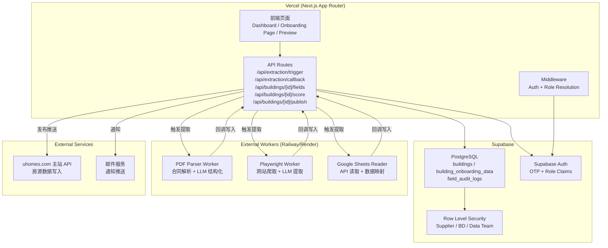
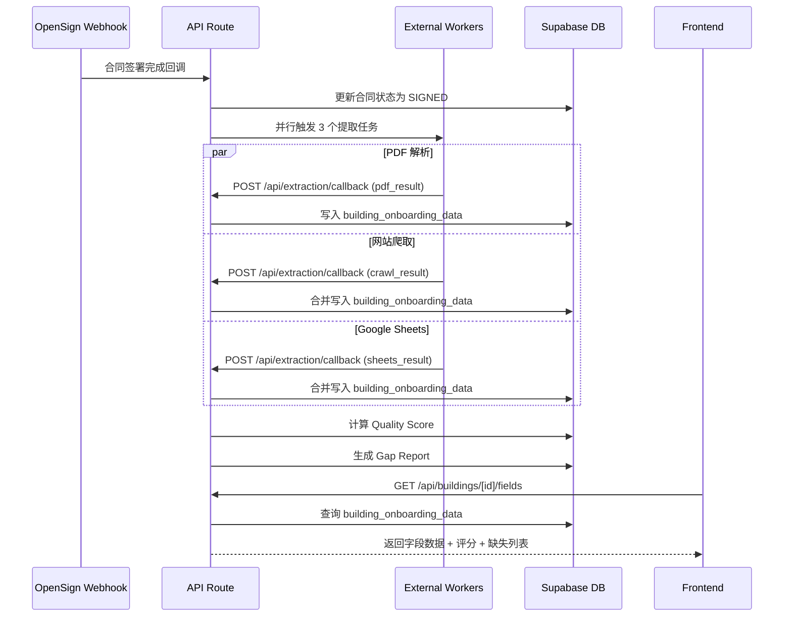

# 设计文档：Building Onboarding Portal

## Overview

Building Onboarding Portal 是 on.uhomes.com 平台从 P0（签约流程）进入 P1/P2（信息采集与上架）的核心模块。系统在供应商签署合同后，自动从多个数据源并行提取信息，通过质量评分驱动上架流程，最终将标准化数据推送至 uhomes.com 主站。

### 核心设计原则

1. **Building 粒度独立性**：一个供应商可能有多个 building，每个 building 独立进行 onboarding、评分和发布，互不影响
2. **Schema-Driven 字段管理**：所有 onboarding 字段通过 Field Schema 配置定义，支持动态扩展而无需数据库迁移
3. **来源追踪**：每个字段值都携带数据来源和置信度元数据，支持冲突检测和审计
4. **渐进式数据填充**：AI 提取 → 人工确认 → 手动补充，三阶段渐进完善数据

## Architecture

### 系统架构图



### 请求流程



## Components and Interfaces

### 1. Field Schema 定义模块

Field Schema 是整个系统的核心配置，定义了所有 onboarding 字段的元数据。采用 TypeScript 常量配置而非数据库存储，便于类型安全和版本控制。

```typescript
// src/lib/onboarding/field-schema.ts

type FieldCategory =
  | 'basic_info'
  | 'commission'
  | 'contacts'
  | 'availability'
  | 'booking_process'
  | 'lease_policy'
  | 'tenant_qualification'
  | 'building_details'
  | 'fees'
  | 'furnishing_room';

type FieldType = 'text' | 'number' | 'boolean' | 'select' | 'multi_select' | 'url' | 'email' | 'phone' | 'json' | 'image_urls';

type ExtractTier = 'A' | 'B' | 'C';

interface FieldDefinition {
  key: string;
  label: string;
  category: FieldCategory;
  type: FieldType;
  weight: number;          // 评分权重 (1-10)
  extractTier: ExtractTier; // A=自动提取, B=部分提取需确认, C=必须手动
  required: boolean;        // 是否为必填字段
  options?: string[];       // select/multi_select 的选项
  description?: string;     // 字段说明
}

// 完整字段定义数组
const FIELD_SCHEMA: FieldDefinition[] = [...]
```

### 2. Scoring Engine 模块

```typescript
// src/lib/onboarding/scoring-engine.ts

interface ScoreResult {
  score: number;              // 0-100
  totalWeight: number;        // 所有字段权重总和
  filledWeight: number;       // 已填写字段权重之和
  missingFields: string[];    // 缺失字段 key 列表
  fieldDetails: Record<string, { filled: boolean; weight: number; category: FieldCategory }>;
}

function calculateScore(
  fieldSchema: FieldDefinition[],
  fieldValues: Record<string, FieldValue>
): ScoreResult
```

### 3. Gap Report 生成模块

```typescript
// src/lib/onboarding/gap-report.ts

interface GapReportItem {
  fieldKey: string;
  label: string;
  category: FieldCategory;
  weight: number;
  extractTier: ExtractTier;
  suggestion: string;  // "需手动填写" | "需确认" | "可自动提取"
}

interface GapReport {
  buildingId: string;
  totalFields: number;
  filledFields: number;
  missingByCategory: Record<FieldCategory, GapReportItem[]>;
}

function generateGapReport(
  fieldSchema: FieldDefinition[],
  fieldValues: Record<string, FieldValue>
): GapReport
```

### 4. Extraction Pipeline 触发与回调

```typescript
// src/app/api/extraction/trigger/route.ts
// POST: 触发提取任务（由合同签署 webhook 调用）

interface ExtractionTriggerPayload {
  buildingId: string;
  supplierId: string;
  contractPdfUrl: string;
  websiteUrl?: string;
  googleSheetsUrl?: string;
}

// src/app/api/extraction/callback/route.ts
// POST: 接收 External Worker 的提取结果回调

interface ExtractionCallbackPayload {
  buildingId: string;
  source: 'contract_pdf' | 'website_crawl' | 'google_sheets';
  extractedFields: Record<string, {
    value: unknown;
    confidence: 'high' | 'medium' | 'low';
  }>;
  status: 'success' | 'partial' | 'failed';
  errorMessage?: string;
}
```

### 5. Building Fields CRUD API

```typescript
// src/app/api/buildings/[buildingId]/fields/route.ts

// GET: 获取 building 的所有字段数据 + 评分 + gap report
interface BuildingFieldsResponse {
  buildingId: string;
  fields: Record<string, FieldValue>;
  score: ScoreResult;
  gapReport: GapReport;
  status: BuildingStatus;
}

// PATCH: 更新单个或多个字段
interface UpdateFieldsPayload {
  fields: Record<string, unknown>;
}

// src/lib/onboarding/field-value.ts
interface FieldValue {
  value: unknown;
  source: 'contract_pdf' | 'website_crawl' | 'google_sheets' | 'manual_input';
  confidence: 'high' | 'medium' | 'low';
  confirmedBy?: string;    // user_id of confirmer
  confirmedAt?: string;    // ISO timestamp
  updatedBy: string;       // user_id
  updatedAt: string;       // ISO timestamp
}
```

### 6. Publish API

```typescript
// src/app/api/buildings/[buildingId]/publish/route.ts

// POST: 推送数据到 uhomes.com 主站
// 前置条件: status === 'ready_to_publish'
// 成功后: status -> 'published'
// 失败后: status 保持 'ready_to_publish', 记录错误
```

### 7. 前端页面组件

```
src/app/
├── dashboard/
│   └── page.tsx                    # 增强版 Dashboard（building 卡片列表）
├── onboarding/
│   └── [buildingId]/
│       ├── page.tsx                # Building Onboarding 编辑页面
│       └── preview/
│           └── page.tsx            # 内部预览页面
```

```typescript
// 核心前端组件
src/components/
├── onboarding/
│   ├── BuildingCard.tsx            # Dashboard 上的 building 状态卡片
│   ├── FieldGroup.tsx              # 按分类分组的字段编辑区域
│   ├── FieldEditor.tsx             # 单个字段的编辑器（根据 type 渲染不同输入控件）
│   ├── ScoreBar.tsx                # 质量评分进度条
│   ├── GapReportPanel.tsx          # 缺失字段面板
│   ├── SourceBadge.tsx             # 数据来源标签
│   └── PreviewCard.tsx             # 模拟 uhomes.com 的房源卡片
```

## Data Models

### 数据库 Schema 扩展

在现有 `buildings` 表基础上，新增 `building_onboarding_data` 表和 `field_audit_logs` 表。

```mermaid
erDiagram
    suppliers ||--o{ buildings : "has many"
    buildings ||--|| building_onboarding_data : "has one"
    buildings ||--o{ field_audit_logs : "has many"
    buildings ||--o{ extraction_jobs : "has many"

    suppliers {
        uuid id PK
        uuid user_id FK
        text company_name
        text contact_email
        text status
        text role "supplier | bd | data_team"
    }

    buildings {
        uuid id PK
        uuid supplier_id FK
        text building_name
        text building_address
        text city
        text country
        integer score
        text onboarding_status "extracting | incomplete | previewable | ready_to_publish | published"
        boolean is_published
        timestamptz created_at
        timestamptz updated_at
    }

    building_onboarding_data {
        uuid id PK
        uuid building_id FK
        jsonb field_values "所有字段值及元数据的 JSON 存储"
        integer version "乐观锁版本号"
        timestamptz created_at
        timestamptz updated_at
    }

    field_audit_logs {
        uuid id PK
        uuid building_id FK
        uuid user_id FK
        text user_role
        text field_key
        jsonb old_value
        jsonb new_value
        timestamptz created_at
    }

    extraction_jobs {
        uuid id PK
        uuid building_id FK
        text source "contract_pdf | website_crawl | google_sheets"
        text status "pending | running | completed | failed | timeout"
        jsonb extracted_data
        text error_message
        timestamptz started_at
        timestamptz completed_at
        timestamptz created_at
    }
```



### field_values JSON 结构

`building_onboarding_data.field_values` 的 JSON 结构示例：

```json
{
  "building_name": {
    "value": "Housing 4 You Portfolio Toronto",
    "source": "contract_pdf",
    "confidence": "high",
    "confirmedBy": null,
    "confirmedAt": null,
    "updatedBy": "system",
    "updatedAt": "2026-02-22T10:00:00Z"
  },
  "price_min": {
    "value": 1200,
    "source": "google_sheets",
    "confidence": "medium",
    "confirmedBy": "user-uuid-123",
    "confirmedAt": "2026-02-22T11:00:00Z",
    "updatedBy": "user-uuid-123",
    "updatedAt": "2026-02-22T11:00:00Z"
  },
  "key_amenities": {
    "value": ["gym", "pool", "laundry", "parking"],
    "source": "website_crawl",
    "confidence": "low",
    "confirmedBy": null,
    "confirmedAt": null,
    "updatedBy": "system",
    "updatedAt": "2026-02-22T10:30:00Z"
  }
}
```

### SQL Migration（新增表）

```sql
-- 新增 onboarding_status 到 buildings 表
ALTER TABLE public.buildings
ADD COLUMN IF NOT EXISTS onboarding_status text
  DEFAULT 'incomplete'
  CHECK (onboarding_status IN (
    'extracting', 'incomplete', 'previewable',
    'ready_to_publish', 'published'
  ));

-- 新增 role 到 suppliers 表（区分 supplier / bd / data_team）
ALTER TABLE public.suppliers
ADD COLUMN IF NOT EXISTS role text
  DEFAULT 'supplier'
  CHECK (role IN ('supplier', 'bd', 'data_team'));

-- Building Onboarding Data 表
CREATE TABLE public.building_onboarding_data (
  id uuid DEFAULT gen_random_uuid() PRIMARY KEY,
  building_id uuid REFERENCES public.buildings(id) ON DELETE CASCADE NOT NULL UNIQUE,
  field_values jsonb DEFAULT '{}'::jsonb NOT NULL,
  version integer DEFAULT 1 NOT NULL,
  created_at timestamptz DEFAULT now() NOT NULL,
  updated_at timestamptz DEFAULT now() NOT NULL
);

-- Field Audit Logs 表
CREATE TABLE public.field_audit_logs (
  id uuid DEFAULT gen_random_uuid() PRIMARY KEY,
  building_id uuid REFERENCES public.buildings(id) ON DELETE CASCADE NOT NULL,
  user_id uuid NOT NULL,
  user_role text NOT NULL,
  field_key text NOT NULL,
  old_value jsonb,
  new_value jsonb,
  created_at timestamptz DEFAULT now() NOT NULL
);

-- Extraction Jobs 表
CREATE TABLE public.extraction_jobs (
  id uuid DEFAULT gen_random_uuid() PRIMARY KEY,
  building_id uuid REFERENCES public.buildings(id) ON DELETE CASCADE NOT NULL,
  source text NOT NULL CHECK (source IN ('contract_pdf', 'website_crawl', 'google_sheets')),
  status text NOT NULL DEFAULT 'pending'
    CHECK (status IN ('pending', 'running', 'completed', 'failed', 'timeout')),
  extracted_data jsonb DEFAULT '{}'::jsonb,
  error_message text,
  started_at timestamptz,
  completed_at timestamptz,
  created_at timestamptz DEFAULT now() NOT NULL
);

-- RLS Policies
ALTER TABLE public.building_onboarding_data ENABLE ROW LEVEL SECURITY;
ALTER TABLE public.field_audit_logs ENABLE ROW LEVEL SECURITY;
ALTER TABLE public.extraction_jobs ENABLE ROW LEVEL SECURITY;

-- Suppliers 可查看自己 building 的 onboarding 数据
CREATE POLICY "Suppliers can view own building onboarding data"
  ON public.building_onboarding_data FOR SELECT TO authenticated
  USING (EXISTS (
    SELECT 1 FROM public.buildings b
    JOIN public.suppliers s ON s.id = b.supplier_id
    WHERE b.id = building_onboarding_data.building_id
    AND s.user_id = auth.uid()
  ));

-- Suppliers 可更新自己 building 的 onboarding 数据
CREATE POLICY "Suppliers can update own building onboarding data"
  ON public.building_onboarding_data FOR UPDATE TO authenticated
  USING (EXISTS (
    SELECT 1 FROM public.buildings b
    JOIN public.suppliers s ON s.id = b.supplier_id
    WHERE b.id = building_onboarding_data.building_id
    AND s.user_id = auth.uid()
  ));

-- BD 和 Data Team 可查看和编辑所有数据（通过 role claim）
CREATE POLICY "BD and Data Team can view all onboarding data"
  ON public.building_onboarding_data FOR SELECT TO authenticated
  USING (EXISTS (
    SELECT 1 FROM public.suppliers
    WHERE suppliers.user_id = auth.uid()
    AND suppliers.role IN ('bd', 'data_team')
  ));

CREATE POLICY "BD and Data Team can update all onboarding data"
  ON public.building_onboarding_data FOR UPDATE TO authenticated
  USING (EXISTS (
    SELECT 1 FROM public.suppliers
    WHERE suppliers.user_id = auth.uid()
    AND suppliers.role IN ('bd', 'data_team')
  ));

-- Triggers
CREATE TRIGGER set_building_onboarding_data_updated_at
  BEFORE UPDATE ON public.building_onboarding_data
  FOR EACH ROW EXECUTE FUNCTION public.handle_updated_at();
```

### Middleware 路由扩展

现有 middleware 需要扩展以支持 SIGNED 状态用户访问 onboarding 页面（而非直接跳转 pro.uhomes.com）：

```typescript
// 修改 middleware.ts 中的路由逻辑
// SIGNED 用户现在可以访问 /dashboard 和 /onboarding/*
// 仅当 SIGNED 用户访问 / 或 /login 时才跳转到 /dashboard
```

## Correctness Properties

*A property is a characteristic or behavior that should hold true across all valid executions of a system — essentially, a formal statement about what the system should do. Properties serve as the bridge between human-readable specifications and machine-verifiable correctness guarantees.*

### Property 1: 并行触发完整性

*For any* 合同签署完成事件，触发提取后应恰好创建 3 个 extraction_jobs 记录（contract_pdf、website_crawl、google_sheets 各一个），且每个 job 的初始状态为 pending。

**Validates: Requirements 1.1**

### Property 2: 超时容错 — 部分结果可用性

*For any* 一组提取任务状态组合（其中至少一个为 completed），当存在 timeout 状态的任务时，系统应使用已完成任务的数据继续后续流程（生成 Building_Record），且超时任务被标记为 timeout 状态。

**Validates: Requirements 1.5**

### Property 3: 多源数据融合优先级与来源追踪

*For any* 字段和任意多源提取结果组合（contract_pdf、website_crawl、google_sheets），融合后的字段值应选择最高优先级来源（contract_pdf > google_sheets > website_crawl）的值，且融合后的每个字段都包含 source、confidence、updatedBy、updatedAt 元数据。

**Validates: Requirements 1.6, 1.7**

### Property 4: Field Schema 结构完整性

*For any* FieldDefinition in FIELD_SCHEMA，该定义应包含所有必需属性（key、label、category、type、weight、extractTier、required），且 weight 在 1-10 范围内，category 属于预定义的 10 个分类之一，extractTier 属于 A/B/C 之一。

**Validates: Requirements 2.1**

### Property 5: Gap Report 正确性

*For any* field_schema 和 field_values 组合，生成的 Gap Report 中的缺失字段集合应恰好等于 field_schema 中定义但在 field_values 中不存在或值为空的字段集合。且每个缺失字段的 suggestion 应与其 extractTier 对应：C-tier → "需手动填写"，B-tier → "需确认"，A-tier → "可自动提取"。

**Validates: Requirements 2.2, 2.3, 2.4**

### Property 6: 审计日志完整性

*For any* 字段更新操作（包含操作人 ID、字段名、新值），系统应在 field_audit_logs 中创建一条记录，包含正确的 user_id、user_role、field_key、old_value（更新前的值）和 new_value（更新后的值），且 old_value 与更新前数据库中的值一致。

**Validates: Requirements 3.3, 8.2**

### Property 7: 角色权限隔离

*For any* 用户和 building 组合，访问权限应满足：Supplier 仅能访问自己 supplier_id 关联的 building；BD_Staff 能访问其负责的供应商关联的所有 building；Data_Team 能访问所有 building。不满足条件的访问应返回空结果或拒绝。

**Validates: Requirements 3.4, 3.5, 3.6, 9.1, 9.2, 9.3**

### Property 8: 评分计算正确性

*For any* field_schema 和 field_values 组合，Quality_Score 应等于 round(filledWeight / totalWeight × 100)，其中 filledWeight 是 field_values 中有值的字段对应权重之和，totalWeight 是 field_schema 中所有字段权重之和。结果应在 0-100 范围内。

**Validates: Requirements 4.1, 4.3**

### Property 9: 状态阈值双向转换

*For any* Building_Record，当 Quality_Score 从低于 80 变为 ≥80 时，onboarding_status 应变为 previewable；当 Quality_Score 从 ≥80 变为低于 80 时，onboarding_status 应回退为 incomplete。状态转换应与分数阈值严格对应。

**Validates: Requirements 4.4, 4.5**

### Property 10: 渲染数据完整性

*For any* Building_Record 的渲染输出（预览卡片或 Dashboard 卡片），输出应包含 building_name、当前 Quality_Score 和 onboarding_status。对于预览页面，还应包含 building_address、price_range、cover_image 和 unit_types_summary（如果这些字段有值）。

**Validates: Requirements 5.2, 6.2**

### Property 11: Dashboard Building 列表一致性

*For any* Supplier，Dashboard 返回的 building 列表应恰好等于数据库中该 Supplier 的 supplier_id 关联的所有 building 记录集合，不多不少。

**Validates: Requirements 6.1, 6.4**

### Property 12: 异步补充保护已确认字段

*For any* 异步提取回调写入操作和任意 Building_Record，如果某字段的 confirmedBy 不为空（已被人工确认），则该字段的值在异步补充后应保持不变。仅 confirmedBy 为空的字段可被异步补充覆盖。

**Validates: Requirements 8.3**

## Error Handling

### 提取管道错误处理

| 错误场景 | 处理策略 |
|:---------|:---------|
| PDF 解析失败 | extraction_job 标记为 failed，记录 error_message，building 状态保持 extracting，通知 BD 手动处理 |
| 网站爬取超时（>3min） | extraction_job 标记为 timeout，使用已有数据继续，后台异步重试一次 |
| Google Sheets 无权限 | extraction_job 标记为 failed，Gap Report 中标注相关字段为"需手动填写" |
| External Worker 不可达 | API 返回 503，前端展示"提取服务暂时不可用"，支持手动重试 |

### 数据编辑错误处理

| 错误场景 | 处理策略 |
|:---------|:---------|
| 乐观锁冲突（version 不匹配） | 返回 409 Conflict，前端提示"数据已被其他用户修改，请刷新后重试" |
| 字段值类型不匹配 | API 层 Zod 校验拒绝，返回 400 + 具体字段错误信息 |
| RLS 权限拒绝 | Supabase 返回空结果或错误，前端展示"无权限访问此 building" |

### 发布错误处理

| 错误场景 | 处理策略 |
|:---------|:---------|
| 主站 API 返回 4xx | 记录错误详情，状态保持 ready_to_publish，Dashboard 展示具体错误原因 |
| 主站 API 返回 5xx | 记录错误，状态保持 ready_to_publish，自动重试最多 3 次（指数退避） |
| 主站 API 超时 | 同 5xx 处理，额外记录超时时长 |

## Testing Strategy

### 测试框架选型

- **单元测试 + 属性测试**：Vitest（项目已配置）
- **属性测试库**：fast-check（TypeScript 生态最成熟的 PBT 库）
- **最低迭代次数**：每个属性测试 100 次

### 属性测试覆盖

每个 Correctness Property 对应一个独立的属性测试文件/用例：

| Property | 测试文件 | 生成器 |
|:---------|:---------|:-------|
| P1: 并行触发完整性 | `extraction-trigger.property.test.ts` | 随机 contract 签署事件 |
| P2: 超时容错 | `extraction-timeout.property.test.ts` | 随机任务状态组合 |
| P3: 多源融合优先级 | `data-merge.property.test.ts` | 随机多源字段值组合 |
| P4: Field Schema 完整性 | `field-schema.property.test.ts` | 遍历 FIELD_SCHEMA 常量 |
| P5: Gap Report 正确性 | `gap-report.property.test.ts` | 随机 field_values 子集 |
| P6: 审计日志完整性 | `audit-log.property.test.ts` | 随机字段更新操作 |
| P7: 角色权限隔离 | `role-access.property.test.ts` | 随机用户角色 + building 组合 |
| P8: 评分计算正确性 | `scoring.property.test.ts` | 随机 field_values 子集 |
| P9: 状态阈值转换 | `status-transition.property.test.ts` | 随机分数变化序列 |
| P10: 渲染数据完整性 | `render-data.property.test.ts` | 随机 Building_Record |
| P11: Dashboard 列表一致性 | `dashboard-list.property.test.ts` | 随机 Supplier + buildings |
| P12: 异步补充保护 | `async-update-protection.property.test.ts` | 随机已确认/未确认字段组合 |

### 单元测试覆盖

单元测试聚焦于具体示例和边界情况：

- **Scoring Engine**：空 field_values → 0 分；全部填写 → 100 分；恰好 80 分的边界
- **Gap Report**：空 schema → 空报告；全部缺失 → 完整缺失列表
- **Data Merge**：单源数据 → 直接采用；三源全部冲突 → 选择合同值
- **Status Transition**：79→80 分 → previewable；80→79 分 → incomplete；80→85 分 → 无变化
- **Publish Flow**：成功 → published；失败 → 保持 ready_to_publish + 错误记录

### 测试标签格式

每个属性测试用例使用以下注释标签：

```typescript
// Feature: building-onboarding-portal, Property 8: 评分计算正确性
// Validates: Requirements 4.1, 4.3
```
