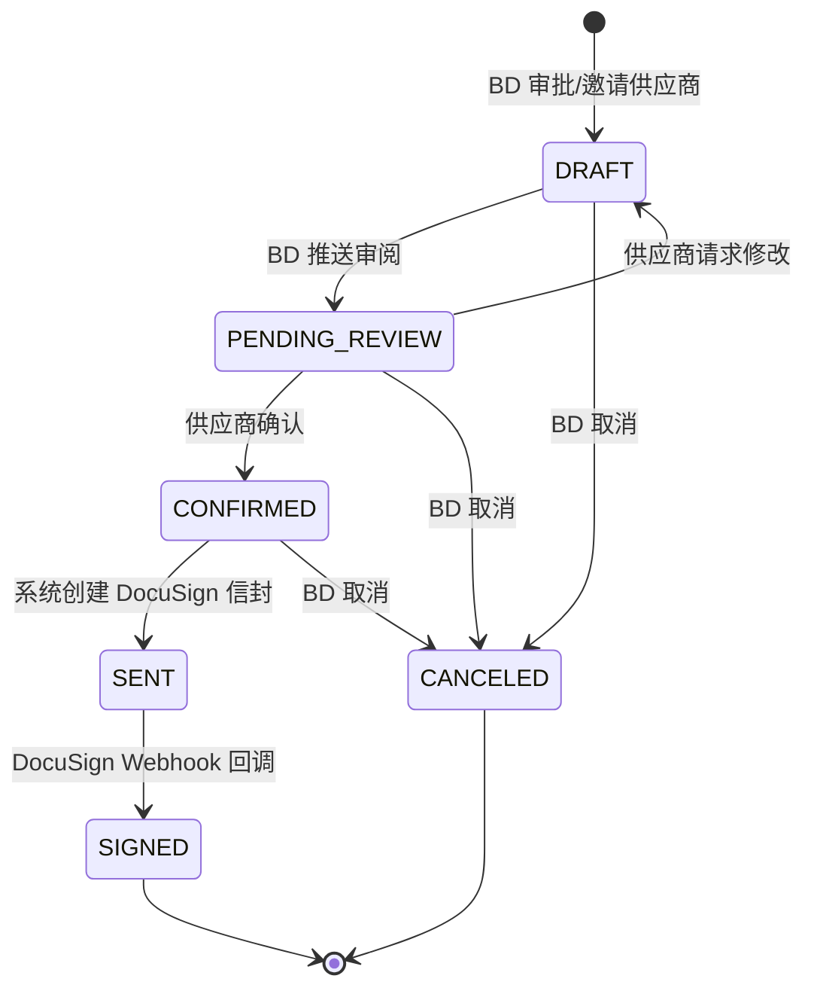
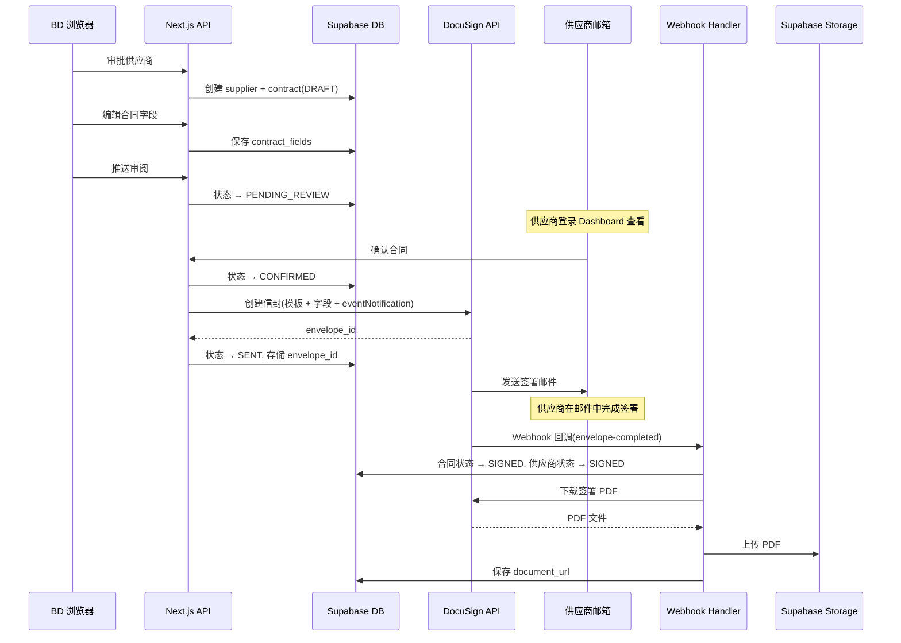

# 设计文档：在线合同签署（DocuSign 集成）

## 概述

本功能将现有的 Mock OpenSign 签约流程替换为真实的 DocuSign eSignature 集成。核心变更包括：

1. 合同状态从简单的 DRAFT→SENT→SIGNED 扩展为 DRAFT→PENDING_REVIEW→CONFIRMED→SENT→SIGNED 五阶段流程
2. BD 可编辑合同动态字段并推送给供应商审阅
3. 供应商确认后系统自动创建 DocuSign 信封，通过邮件完成电子签名
4. 签署完成后自动下载 PDF 存储到 Supabase Storage

核心设计决策：

- 认证方式：DocuSign JWT Grant（服务端 impersonation），无需用户交互授权
- 模板策略：使用 DocuSign 预上传模板 + Text Tabs 动态填充，避免每次上传 PDF
- Webhook：使用 envelope-level eventNotification（Starter 计划兼容），HMAC 签名验证
- 存储：签署 PDF 存入 Supabase Storage `signed-contracts` 桶，通过 signed URL 提供下载
- 向后兼容：保留 OpenSign webhook 路由，直到所有旧合同完成签署

## 架构

### 整体架构

```mermaid
graph TB
    subgraph "BD 端"
        A[BD 浏览器] -->|编辑合同字段| B[/admin/contracts/contractId/edit]
        A -->|推送审阅| C[API: update-contract-status]
    end

    subgraph "供应商端"
        D[供应商浏览器] -->|查看合同| E[/dashboard]
        D -->|确认签署| F[API: confirm-contract]
    end

    subgraph "Next.js App Router"
        B --> G[Contract Editor Page]
        E --> H[Contract Preview Component]
        C --> I[Contract Status API]
        F --> J[Confirm Contract API]
        J --> K[DocuSign Service]
    end

    subgraph "DocuSign"
        K -->|JWT Auth| L[Auth Server]
        K -->|Create Envelope| M[eSign API]
        M -->|签署邮件| N[供应商邮箱]
        M -->|Webhook| O[/api/webhooks/docusign]
    end

    subgraph "Supabase"
        I --> P[(PostgreSQL)]
        J --> P
        O --> P
        O -->|上传 PDF| Q[Storage: signed-contracts]
    end
```

### 合同状态流转



### 新增路由结构

```
/admin/contracts/[contractId]/edit  → BD 合同编辑页（新增）
/api/admin/contracts/[contractId]   → 合同字段保存/状态更新 API（新增）
/api/contracts/[contractId]/confirm → 供应商确认合同 API（新增）
/api/webhooks/docusign              → DocuSign Webhook 回调（新增）
```

## 组件与接口

### 1. DocuSign 服务层（`src/lib/docusign/client.ts`）

封装所有 DocuSign API 交互，遵循单一职责原则：

```typescript
interface DocuSignConfig {
  clientId: string;
  userId: string;
  accountId: string;
  privateKey: string; // Base64 解码后的 RSA 私钥
  authServer: string;
  templateId: string;
  webhookSecret: string;
}

interface ContractFields {
  partner_company_name: string;
  partner_contact_name: string;
  partner_address: string;
  partner_city: string;
  partner_country: string;
  commission_rate: string;
  contract_start_date: string; // ISO date string
  contract_end_date: string; // ISO date string
  covered_properties: string;
}

interface CreateEnvelopeResult {
  envelopeId: string;
}

// 核心接口
async function getAccessToken(): Promise<string>;
async function createEnvelope(
  signerEmail: string,
  signerName: string,
  fields: ContractFields,
): Promise<CreateEnvelopeResult>;
async function downloadSignedDocument(envelopeId: string): Promise<Buffer>;
```

JWT 认证流程：

1. 使用 `docusign-esign` SDK 的 `ApiClient.requestJWTUserToken()`
2. 传入 clientId、userId、authServer、Base64 解码后的 privateKey
3. 获取 access_token，缓存至过期前（token 有效期通常 1 小时）
4. 过期后自动重新申请

### 2. 合同状态机（`src/lib/contracts/status-machine.ts`）

纯函数实现，无副作用，便于测试：

```typescript
type ContractStatus =
  | "DRAFT"
  | "PENDING_REVIEW"
  | "CONFIRMED"
  | "SENT"
  | "SIGNED"
  | "CANCELED";

// 合法状态转换表
const VALID_TRANSITIONS: Record<ContractStatus, ContractStatus[]> = {
  DRAFT: ["PENDING_REVIEW", "CANCELED"],
  PENDING_REVIEW: ["CONFIRMED", "DRAFT", "CANCELED"],
  CONFIRMED: ["SENT", "CANCELED"],
  SENT: ["SIGNED"],
  SIGNED: [],
  CANCELED: [],
};

function canTransition(from: ContractStatus, to: ContractStatus): boolean;
function validateTransition(
  from: ContractStatus,
  to: ContractStatus,
): { valid: true } | { valid: false; reason: string };
```

### 3. 合同字段验证（`src/lib/contracts/field-validation.ts`）

纯函数，验证动态字段的完整性和格式：

```typescript
interface FieldValidationResult {
  valid: boolean;
  errors: Record<string, string>; // fieldName → errorMessage
}

function validateContractFields(
  fields: Partial<ContractFields>,
): FieldValidationResult;

// 验证规则：
// - partner_company_name: 非空
// - partner_contact_name: 非空
// - partner_address: 非空
// - partner_city: 非空
// - partner_country: 非空
// - commission_rate: 非空，有效数值，范围 0-100
// - contract_start_date: 非空，有效日期
// - contract_end_date: 非空，有效日期，晚于 start_date
// - covered_properties: 非空
```

### 4. HMAC 签名验证（`src/lib/docusign/hmac.ts`）

验证 DocuSign Webhook 回调的 HMAC 签名：

```typescript
function verifyDocuSignHmac(
  payload: string,
  signature: string,
  secret: string,
): boolean;
// 使用 crypto.createHmac('sha256', secret) 计算并比较
```

### 5. BD 合同编辑页（`src/app/admin/contracts/[contractId]/edit/page.tsx`）

Server Component 加载合同数据，Client Component 处理编辑交互：

```typescript
// Server Component: 加载合同 + 供应商数据
// Client Component: ContractEditForm
interface ContractEditFormProps {
  contractId: string;
  initialFields: Partial<ContractFields>;
  supplierInfo: { company_name: string; city: string | null };
  contractStatus: ContractStatus;
}
```

功能：

- DRAFT 状态：可编辑所有字段，保存按钮 + 推送审阅按钮
- 非 DRAFT 状态：只读模式，显示当前状态
- 自动预填 partner_company_name 和 partner_city

### 6. 供应商合同预览（`src/components/signing/ContractPreview.tsx`）

替代现有 ContractViewer，展示合同详情和操作按钮：

```typescript
interface ContractPreviewProps {
  contractId: string;
  status: ContractStatus;
  fields: ContractFields | null;
  documentUrl: string | null;
}
```

状态对应的 UI：

- DRAFT：显示"合同正在准备中"提示
- PENDING_REVIEW：显示字段详情 + "确认并进入签署"按钮 + "请求修改"按钮
- CONFIRMED：显示"正在创建签署请求..."进度提示
- SENT：显示"签署邮件已发送，请查收邮箱"提示
- SIGNED：显示签署完成 + PDF 下载链接

### 7. API 路由

#### 7.1 合同字段保存与状态更新（`/api/admin/contracts/[contractId]/route.ts`）

BD 专用，Session 鉴权 + role='bd' 验证：

```typescript
// PUT: 保存合同字段
async function PUT(
  request: Request,
  { params }: { params: { contractId: string } },
);
// 1. 验证 BD 角色
// 2. 验证合同存在且状态为 DRAFT
// 3. 验证字段数据
// 4. 更新 contracts.contract_fields

// POST: 推送审阅（DRAFT → PENDING_REVIEW）
async function POST(
  request: Request,
  { params }: { params: { contractId: string } },
);
// 1. 验证 BD 角色
// 2. 验证合同存在且状态为 DRAFT
// 3. 验证所有必填字段已填写
// 4. 更新状态为 PENDING_REVIEW
```

#### 7.2 供应商确认合同（`/api/contracts/[contractId]/confirm/route.ts`）

供应商专用，Session 鉴权 + 供应商身份验证：

```typescript
// POST: 确认合同（PENDING_REVIEW → CONFIRMED → 创建 DocuSign 信封 → SENT）
async function POST(
  request: Request,
  { params }: { params: { contractId: string } },
);
// 1. 验证供应商身份（合同属于当前用户）
// 2. 验证合同状态为 PENDING_REVIEW
// 3. 更新状态为 CONFIRMED
// 4. 调用 DocuSign 创建信封
// 5. 成功：更新状态为 SENT，存储 envelope_id
// 6. 失败：保持 CONFIRMED 状态，记录错误

// POST with action=request_changes: 请求修改（PENDING_REVIEW → DRAFT）
```

#### 7.3 DocuSign Webhook（`/api/webhooks/docusign/route.ts`）

无需用户认证，通过 HMAC 签名验证：

```typescript
async function POST(request: Request);
// 1. 读取请求体和 HMAC 签名 header
// 2. 验证 HMAC 签名
// 3. 解析事件类型
// 4. envelope-completed 事件：
//    a. 通过 envelope_id 查找合同
//    b. 更新合同状态为 SIGNED
//    c. 更新供应商状态为 SIGNED
//    d. 下载签署 PDF → 上传 Supabase Storage → 保存 URL
// 5. 返回 200
```

## 数据模型

### contracts 表变更

需要通过 Migration 执行以下变更：

#### 新增 `contract_fields` 列

```sql
ALTER TABLE public.contracts
ADD COLUMN contract_fields jsonb DEFAULT '{}'::jsonb;
```

#### 更新 status CHECK 约束

```sql
-- 删除旧约束
ALTER TABLE public.contracts DROP CONSTRAINT contracts_status_check;

-- 添加新约束（包含 PENDING_REVIEW 和 CONFIRMED）
ALTER TABLE public.contracts
ADD CONSTRAINT contracts_status_check
CHECK (status IN ('DRAFT', 'PENDING_REVIEW', 'CONFIRMED', 'SENT', 'SIGNED', 'CANCELED'));
```

### contract_fields JSONB 结构

```json
{
  "partner_company_name": "Acme Properties Ltd",
  "partner_contact_name": "John Smith",
  "partner_address": "123 Main St",
  "partner_city": "London",
  "partner_country": "UK",
  "commission_rate": "15",
  "contract_start_date": "2026-03-01",
  "contract_end_date": "2027-02-28",
  "covered_properties": "All London properties"
}
```

### Supabase Storage 配置

创建 `signed-contracts` 存储桶：

- 访问级别：private（通过 signed URL 提供下载）
- 文件命名规则：`{supplier_id}/{contract_id}.pdf`
- RLS 策略：供应商只能访问自己的合同文件，BD 可访问所有

### 完整数据流



## 正确性属性

_属性（Property）是系统在所有有效执行中都应保持为真的特征或行为——本质上是对系统应做什么的形式化陈述。属性是人类可读规格与机器可验证正确性保证之间的桥梁。_

### Property 1: 合同状态机转换正确性

*对于任意*当前状态和目标状态的组合，`canTransition(from, to)` 返回 `true` 当且仅当该转换存在于合法转换表中。具体而言：DRAFT 只能转到 PENDING_REVIEW 或 CANCELED；PENDING_REVIEW 只能转到 CONFIRMED、DRAFT 或 CANCELED；CONFIRMED 只能转到 SENT 或 CANCELED；SENT 只能转到 SIGNED；SIGNED 和 CANCELED 不能转到任何状态。

**Validates: Requirements 1.1, 1.3, 1.4, 1.5**

### Property 2: 合同字段验证完整性

*对于任意*合同字段输入集合，验证函数应满足：当任一必填字段为空时返回无效并列出该字段；当 commission_rate 不是有效数值或超出 0-100 范围时返回无效；当 contract_start_date 不早于 contract_end_date 时返回无效；当所有字段均合法时返回有效。验证结果的 errors 对象应精确包含所有不合法字段的键。

**Validates: Requirements 3.3, 4.1, 4.3**

### Property 3: 合同字段持久化往返一致性

*对于任意*有效的合同字段对象，将其序列化存储到 `contract_fields` JSONB 列后再读取回来，应产生与原始对象等价的值。

**Validates: Requirements 3.4**

### Property 4: 合同可编辑性由状态决定

*对于任意*合同状态，合同可编辑当且仅当状态为 DRAFT。所有其他状态（PENDING_REVIEW、CONFIRMED、SENT、SIGNED、CANCELED）下合同应为只读。

**Validates: Requirements 3.5**

### Property 5: DocuSign Text Tabs 映射完整性

*对于任意*有效的合同字段对象，生成的 Text Tabs 数组应包含与所有 9 个动态字段一一对应的 tab 项，每个 tab 的 `tabLabel` 与字段名匹配，`value` 与字段值匹配。

**Validates: Requirements 6.2**

### Property 6: HMAC 签名验证正确性

*对于任意*请求体和密钥，使用该密钥对请求体计算的 HMAC-SHA256 签名应通过验证；使用不同密钥或篡改请求体后的签名应验证失败。

**Validates: Requirements 7.2, 7.3**

### Property 7: Webhook 幂等性

*对于任意*已处于 SIGNED 状态的合同，重复处理相同的 webhook 回调应返回 200 状态码，且合同的 signed_at、document_url 等字段不发生变化。

**Validates: Requirements 7.8**

### Property 8: Webhook 级联状态更新

*对于任意*有效的 envelope-completed webhook 事件，处理完成后对应的合同状态应为 SIGNED 且 signed_at 非空，关联的供应商状态也应为 SIGNED。

**Validates: Requirements 7.5, 7.6**

### Property 9: 新建合同初始状态

*对于任意*通过审批或邀请流程创建的合同，初始状态应为 DRAFT，signature_provider 应为 "DOCUSIGN"，embedded_signing_url 和 signature_request_id 应为 null。

**Validates: Requirements 1.2, 9.1, 9.2, 9.3**

### Property 10: 缺失环境变量错误提示

*对于任意*单个缺失的 DocuSign 环境变量，DocuSign_Client 在首次调用时应返回包含该变量名称的错误信息。

**Validates: Requirements 10.2**

### Property 11: 合同预览字段渲染完整性

*对于任意*有效的合同字段对象，预览渲染结果应包含所有 9 个动态字段的值。

**Validates: Requirements 5.1**

### Property 12: Base64 私钥解码往返一致性

*对于任意*有效的 PEM 格式 RSA 私钥，Base64 编码后再解码应产生与原始私钥等价的值。

**Validates: Requirements 2.3**

## 错误处理

### API 层错误处理

| 错误场景                      | HTTP 状态码 | 响应体                                                          | 处理方式                                   |
| ----------------------------- | ----------- | --------------------------------------------------------------- | ------------------------------------------ |
| 未认证用户调用 admin 合同 API | 401         | `{ error: "Unauthorized" }`                                     | 前端重定向到登录页                         |
| 非 BD 角色调用 admin 合同 API | 403         | `{ error: "Forbidden. BD role required." }`                     | 前端显示权限不足提示                       |
| 合同不存在                    | 404         | `{ error: "Contract not found" }`                               | 前端显示记录不存在                         |
| 合同状态不允许当前操作        | 400         | `{ error: "Cannot perform action on contract with status: X" }` | 前端显示状态冲突                           |
| 合同字段验证失败              | 400         | `{ error: "Validation failed", fields: {...} }`                 | 前端高亮错误字段                           |
| 供应商无权操作该合同          | 403         | `{ error: "Contract does not belong to current user" }`         | 前端显示权限错误                           |
| DocuSign API 调用失败         | 502         | `{ error: "DocuSign API error", details: "..." }`               | 前端显示签署服务暂不可用                   |
| DocuSign 环境变量缺失         | 500         | `{ error: "DocuSign configuration missing: VARIABLE_NAME" }`    | 开发者检查环境配置                         |
| Webhook HMAC 验证失败         | 401         | `{ error: "Invalid signature" }`                                | 拒绝处理，不暴露细节                       |
| Webhook envelope_id 未找到    | 404         | `{ error: "Contract not found for envelope" }`                  | 记录日志供排查                             |
| PDF 下载/上传失败             | —           | 合同状态保持 SIGNED                                             | 记录错误到 provider_metadata，支持手动重试 |

### 事务一致性策略

供应商确认合同流程涉及多步操作（状态更新 → DocuSign 创建信封 → 存储 envelope_id）：

1. 先更新状态为 CONFIRMED（乐观锁）
2. 调用 DocuSign API 创建信封
3. 成功：更新状态为 SENT + 存储 envelope_id
4. 失败：保持 CONFIRMED 状态，记录错误到 provider_metadata，前端可重试

Webhook 处理流程（状态更新 → 下载 PDF → 上传 Storage）：

1. 先更新合同和供应商状态（核心操作，必须成功）
2. 再下载和上传 PDF（非核心操作，失败不影响状态）
3. PDF 操作失败时记录错误，支持后续手动触发重试

## 测试策略

### 测试框架选型

- 单元测试 & 属性测试：Vitest + fast-check
- 组件测试：Vitest + React Testing Library
- 属性测试最少运行 100 次迭代

### 属性测试（Property-Based Testing）

每个正确性属性对应一个属性测试，使用 `fast-check` 库生成随机输入。

测试标注格式：`Feature: online-contract-signing, Property N: {property_text}`

关键属性测试：

1. **状态机属性测试**（Property 1）：生成随机 (from, to) 状态对，验证 canTransition 与合法转换表一致
2. **字段验证属性测试**（Property 2）：生成随机字段组合（含缺失字段、无效数值、日期倒序），验证验证函数正确识别所有错误
3. **字段持久化往返测试**（Property 3）：生成随机有效字段对象，序列化后反序列化验证等价性
4. **可编辑性属性测试**（Property 4）：生成随机状态，验证 isEditable 仅对 DRAFT 返回 true
5. **Tab 映射属性测试**（Property 5）：生成随机有效字段，验证生成的 tabs 数组包含所有字段
6. **HMAC 验证属性测试**（Property 6）：生成随机 payload 和 secret，验证正确签名通过、错误签名拒绝
7. **Webhook 幂等性测试**（Property 7）：模拟已签署合同的重复回调，验证无副作用
8. **初始状态属性测试**（Property 9）：验证新建合同的字段初始值
9. **环境变量错误测试**（Property 10）：逐个移除环境变量，验证错误信息包含变量名
10. **Base64 往返测试**（Property 12）：生成随机 PEM 密钥字符串，验证编码解码往返一致

### 单元测试

单元测试聚焦于：

- DocuSign 信封创建的请求结构验证（eventNotification 配置）
- Webhook 处理的具体场景（envelope-completed 事件、未知 envelope_id）
- 合同字段自动预填逻辑
- DocuSign API 失败时的错误记录
- PDF 下载/上传失败时的降级处理

### 测试文件组织

```
src/
├── lib/contracts/__tests__/
│   ├── status-machine.test.ts       # 状态机属性测试 (Property 1, 4)
│   └── field-validation.test.ts     # 字段验证属性测试 (Property 2, 3)
├── lib/docusign/__tests__/
│   ├── hmac.test.ts                 # HMAC 验证属性测试 (Property 6)
│   ├── tab-mapping.test.ts          # Tab 映射属性测试 (Property 5)
│   ├── client.test.ts               # DocuSign 客户端测试 (Property 10, 12)
│   └── envelope.test.ts             # 信封创建单元测试
├── app/api/webhooks/docusign/__tests__/
│   └── route.test.ts                # Webhook 处理测试 (Property 7, 8)
└── components/signing/__tests__/
    └── ContractPreview.test.tsx      # 合同预览渲染测试 (Property 11)
```
