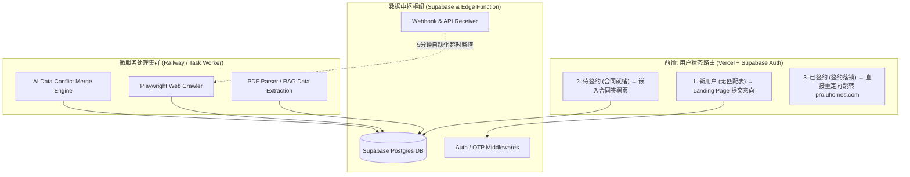

# on.uhomes.com 系统架构与核心链路

## 1. 系统边界与数据流向

本系统定位于全球公寓供应商入口（B2B 面海平台），系统核心目标为获取资料、签署电子合同并进行自动化聚合上架。
系统中不再涵盖房源预订信息的深度管理进程，相关管理能力下放收拢至 `pro.uhomes.com`；CRM 面向业务运营审核均回流接入至 `crm.uhomes.com`。

## 2. 工程部署节点

- **前端承载**：部署于 **Vercel**；负责承载响应式界面与 Supabase SSR Client 数据直出，提供用户鉴权中间件护城河。
- **数据库中心**：使用 **Supabase**。依托内部基于 Postgres 建立安全屏障 (RLS)，隔离各家海外供应商仅可访问自身数据视图与上传文件。
- **爬虫及文档算力层 (Worker)**：拟选址使用 **Railway** 作为运行环境，通过 HTTP 协议暴露触发端口，运行 Playwright 解决 Javascript 强渲染等爬虫阻力以及通过 LLM 读取分析外文租赁长协数据。

## 3. API 路由表

| Method | Path                                  | Auth               | Description                               |
| ------ | ------------------------------------- | ------------------ | ----------------------------------------- |
| POST   | `/api/apply`                          | Public             | Landing Page 提交入驻意向                 |
| POST   | `/api/admin/invite-supplier`          | Session (BD)       | BD 邀请供应商，自动分配 bd_user_id        |
| POST   | `/api/admin/approve-supplier`         | Session (BD)       | BD 审核通过申请，创建供应商账号           |
| POST   | `/api/admin/assign-bd`                | Session (Admin)    | Admin 分配/更换供应商的负责 BD            |
| PUT    | `/api/admin/contracts/[contractId]`   | Session (BD)       | 保存合同字段（仅 DRAFT 状态）             |
| POST   | `/api/admin/contracts/[contractId]`   | Session (BD)       | 提交合同审核（DRAFT → PENDING_REVIEW）    |
| POST   | `/api/contracts/[contractId]/confirm` | Session (BD/Admin) | 确认合同并发送签署（含 resend）           |
| POST   | `/api/webhooks/docusign`              | HMAC Signature     | DocuSign 签署完成回调（主签约通道）       |
| POST   | `/api/webhooks/opensign`              | HMAC Signature     | ~~OpenSign 回调（已废弃，仅兼容旧合同）~~ |
